# ESP32 Personal Dashboard

A touchscreen desk dashboard on an ESP32-S3 with a 4" display: Singapore
weather, live bus arrivals, today's calendar, a digital business card and a
voice assistant you wake by saying **"Jarvis"**. Everything runs on the board
itself, with no server in between.

<p align="center"><b>Day</b> (left) and <b>Night</b> (right)</p>

<p align="center">
  <b>Weather</b><br>
  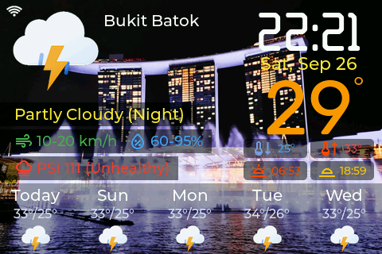
  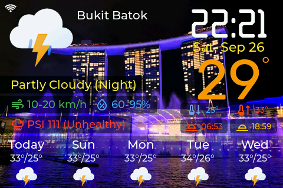
</p>

<p align="center">
  <b>Profile</b><br>
  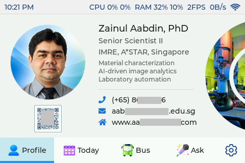
  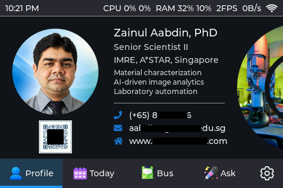
</p>

<p align="center">
  <b>Today</b><br>
  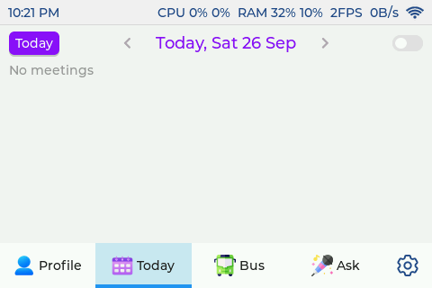
  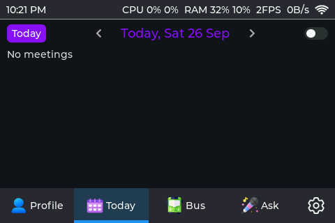
</p>

<p align="center">
  <b>Bus</b><br>
  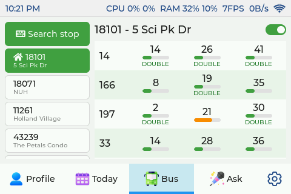
  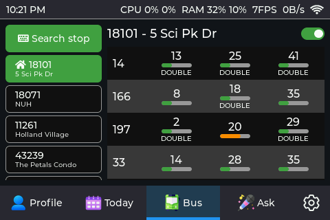
</p>

<p align="center">
  <b>Ask</b><br>
  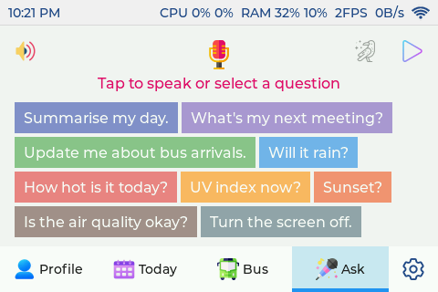
  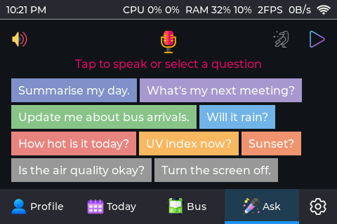
</p>

<p align="center">
  <b>Settings</b><br>
  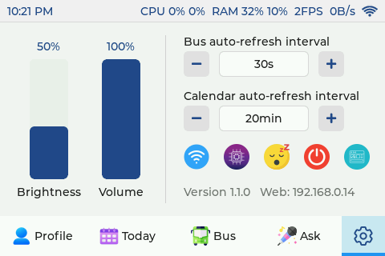
  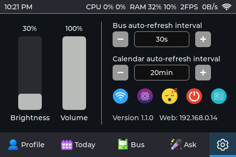
</p>

## Web dashboard

Open `http://<board-ip>/` from a phone or PC on the same Wi-Fi (or scan the
QR code under Settings > dashboard icon on the board). Log in as `admin`.

<p align="center">
  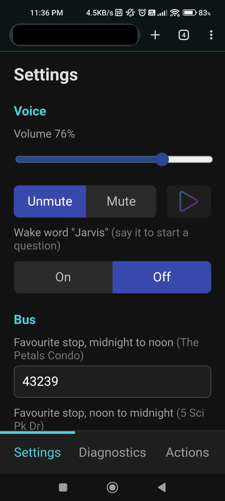
  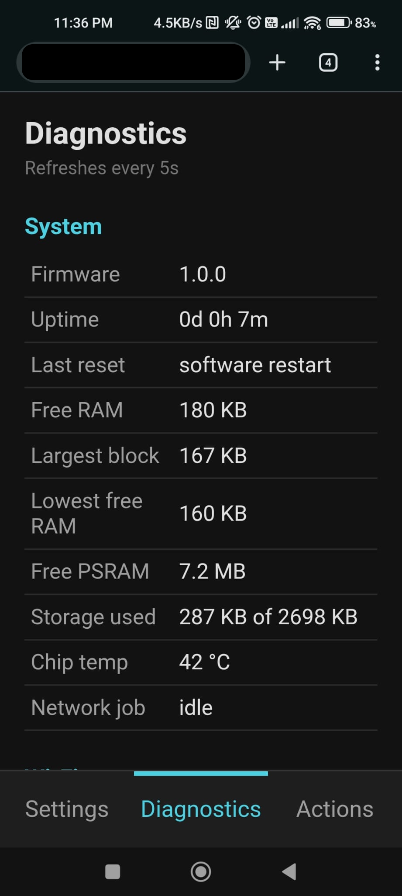
  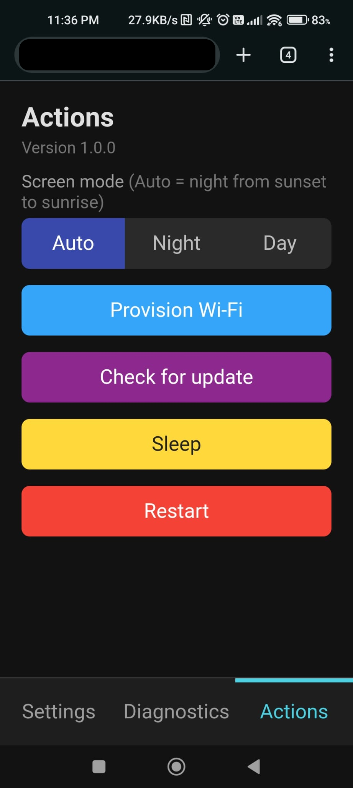
</p>

- **Settings**: voice (volume, mute, replay, wake word), favourite bus
  stops, weather area and update interval, refresh intervals, screen
  brightness, calendar link and API keys (write-only, only the last 4
  characters are shown).
- **Diagnostics**: firmware, uptime, memory, storage, chip temperature,
  Wi-Fi, and OK/failed status for each data source. Refreshes every 5 s.
- **Actions**: screen mode (Auto/Night/Day), Wi-Fi setup, check for and
  install updates, sleep and restart.

## Features

- **Weather**: a full-screen weather display from NEA (data.gov.sg) with the
  current temperature, the 2-hour forecast for your area, humidity, wind,
  PSI and UV, a 5-day outlook, and sunrise and sunset times. Swipe down from
  the top to open it.
- **Bus**: live LTA DataMall arrivals with bus type and crowding bars. Stops
  can be searched, recent stops are remembered, and there are two favourite
  stops (one for mornings, one for afternoons) that switch automatically.
- **Today**: an agenda built from an Outlook/ICS calendar link.
- **Ask**: tap the mic or say "Jarvis" and ask a question. OpenAI gives a
  short answer on screen and speaks it. The answer takes your real bus,
  calendar and weather data into account. Voice commands work too ("switch
  to night mode", "show the bus tab", "volume 50"). One-tap question strips
  ask common questions without speaking.
- **Profile**: a business card with a photo and a QR code that enlarges when
  tapped.
- **Night mode**: dark colours and lower brightness, switched automatically
  at sunset and sunrise (Auto) or set to Night or Day.
- **Web settings page**: `http://<board-ip>/` with Settings, Diagnostics and
  Actions tabs (API keys, favourite stops, weather area, volume, wake word,
  screen mode, update, sleep, restart). A QR code on the board opens it.
- **Over-the-air updates** from this repo's GitHub releases.
- **Wi-Fi setup by QR code**, plus light and deep sleep, and a status LED.

## Hardware

- [LCDWiki 4.0" ESP32-S3 display](https://www.lcdwiki.com/4.0inch_ESP32-S3_Display):
  an ESP32-S3 with 8 MB of octal PSRAM and 16 MB of flash, a 480×320 ST7796
  display, FT6336 touch, an ES8311 audio codec with a microphone and
  speaker, and a WS2812 LED.

## Software

- PlatformIO with Arduino-ESP32 2.0.17 (ESP-IDF 4.4)
- LVGL 8.3 and TFT_eSPI
- ESP-SR WakeNet9 for the "Jarvis" wake word (in `lib/esp_sr`)
- APIs: LTA DataMall, data.gov.sg (NEA), OpenAI (`gpt-audio-mini`)

## Getting started

### What you need

| What | Where to get it | Needed for |
|---|---|---|
| The board above and a USB-C cable | | everything |
| [PlatformIO](https://platformio.org/) (VS Code extension or CLI) | | building and flashing |
| LTA DataMall API key | free, [datamall.lta.gov.sg](https://datamall.lta.gov.sg/content/datamall/en/request-for-api.html) | Bus tab |
| OpenAI API key | [platform.openai.com](https://platform.openai.com/api-keys) (paid, a few cents a day of use) | Ask tab and voice |
| Calendar ICS link | Outlook: Settings > Calendar > Shared calendars > Publish a calendar > ICS link | Today tab |
| Your home bus stop code | the 5-digit code on the stop's sign | favourite stop |

Weather comes from data.gov.sg and needs no key. Everything is optional
except Wi-Fi: a tab whose key is missing just shows an error.

### 1. Keys

Copy `include/secrets.h.example` to `include/secrets.h` and fill in what
you have. `secrets.h` is gitignored, so it never leaves your PC.

```c
static const char *WIFI_DEFAULT_SSID = "";          // optional - QR setup works too
static const char *WIFI_DEFAULT_PASSWORD = "";
static const char *LTA_API_KEY = "...";
static const char *FAVORITE_BUS_STOP = "43239";
static const char *OUTLOOK_ICS_URL = "https://...";
static const char *OPENAI_API_KEY = "sk-...";
static const char *GITHUB_OTA_TOKEN = "";           // only if your fork is private
#define WEB_CONFIG_PASSWORD "changeme"              // web page login (user admin)
```

You can also leave `secrets.h` out entirely and enter everything on the
web settings page later (step 4).

### 2. Make it yours

- **Profile tab**: create `src/app/profile_private/` (gitignored) with
  `profile_private.h` (the `PROFILE_*` strings listed in
  `src/app/profile_data.h`) and your own `profile_pic.c` (180x180),
  `qr_small.c` (56x56) and `qr_large.c` (230x230) images. Flash once over
  USB: the board saves the profile in its own flash, and later OTA updates
  (which only carry placeholders) keep showing it.
- **OTA updates** come from the repository named by `OTA_REPO` in
  `src/app/ota.cpp`. Point it at your own fork if you change the code.

### 3. Build and flash (USB)

```sh
pio run -e app -t upload
# one time only: the "Jarvis" wake word model
esptool.py --chip esp32s3 --port COM8 write_flash 0xF70000 models/srmodels_jarvis.bin
```

### 4. First boot

1. With no Wi-Fi in `secrets.h`, the board shows a QR code. Scan it with
   Espressif's **ESP SoftAP Provisioning** app and pick your network.
2. Open **Settings > dashboard icon** on the board and scan the QR code
   with your phone. It opens `http://<board-ip>/` (user `admin`, your
   password).
3. On the web page: keys, calendar link, favourite stops (morning and
   afternoon), weather area, volume, wake word and screen mode.

The board saves every key in its own flash. From then on it doesn't need
`secrets.h` any more, which is what makes key-free releases possible.

### 5. Updates over the air

```sh
# bump FIRMWARE_VERSION in src/app/firmware_version.h, then:
pio run -e release
gh release create v1.0.1 .pio/build/release/firmware.bin --title v1.0.1 --notes "what changed"
```

The `release` environment builds from the empty `secrets.h.example`, so the
published `firmware.bin` contains no keys. Never attach a build from the
`app` environment to a release: it contains your `secrets.h`. The board
checks for a newer release every 6 hours, or when you tap the update icon.

## Project layout

```
src/app/          application code (one .cpp/.h per screen or subsystem)
src/app/icons/    images converted to LVGL C arrays
src/app/fonts/    custom fonts (clock and temperature digits)
include/          lv_conf.h, secrets.h.example
lib/              LVGL, TFT_eSPI, touch driver, ESP-SR
icons/            original icon and background art
models/           wake word model image
docs/             user guide, screenshots, screenshot script
```

## Screenshots

The images above were taken straight from the display over USB serial:

```sh
pip install pyserial pillow
python docs/screenshot.py --port COM8   # day + night
```

The firmware answers the `shot` serial command with a raw frame. `tab <n>`
and `weather` switch screens. See `docs/screenshot.py`.

## More

- [docs/user-guide.txt](docs/user-guide.txt): status LED colours, OTA, web
  page, favourites, night mode, weather, Ask commands and the wake word.
- [CLAUDE.md](CLAUDE.md): development notes, board quirks and debugging
  write-ups.
